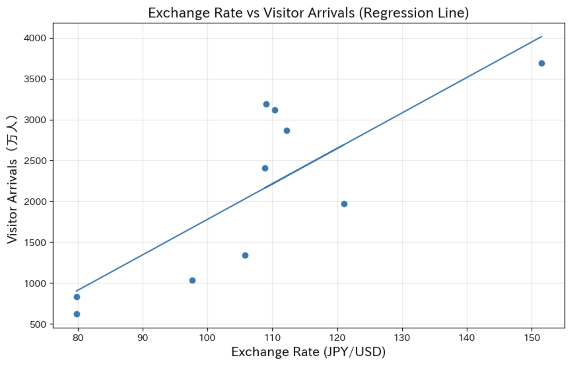
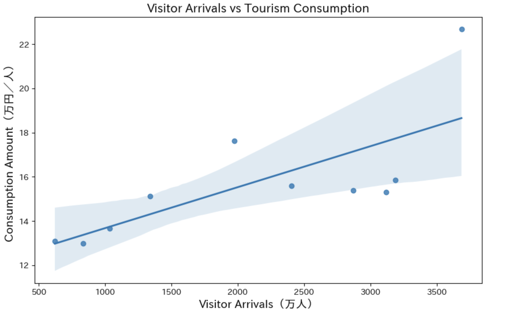

# Inbound Tourism Analysis
### Exchange Rates and Inbound Tourism in Japan: Effects on Visitor Arrivals and Spending

## Overview
This project analyzes the relationship between the Japanese yen exchange rate and inbound tourism demand in Japan using official statistical data.

## Data Sources
#### JNTO (Foreign Visitors to Japan, Tourism Consumption)
- foreign_visitors_yearly.csv: https://statistics.jnto.go.jp/graph/#graph--inbound--travelers--transition
- expenditure_per_foreign_tourist.csv: https://statistics.jnto.go.jp/graph/#graph--inbound--consumption--transition
#### Bank of Japan (Exchange Rate)
- exchange_rate_monthly.csv: https://www.stat-search.boj.or.jp/ssi/cgi-bin/famecgi2?cgi=$graphwnd
##### Note: Data for 2020–2022 were excluded because tourism consumption data were not available for those years due to the COVID-19 pandemic.

## Key Findings
- A relatively strong correlation (0.808238) was observed between the number of visitors to Japan and the weak yen.
- The correlation (0.960283) between per capita tourism spending (Consumption Amount) and the weak yen (usd_jpy) is likely a trend correlation influenced by time trends.
- The weaker the yen becomes, the lower the real effective exchange rate falls, and as Japan’s “real purchasing power” declines, Japanese goods and services become relatively cheaper over time; from a foreigner’s perspective, “Japan becomes cheaper.”

## Visualization
###
###
### Consumption Amount by Year

Consumption per tourists shows a general upward trend over time, with a temporary dip after 2015 followed by a strong increase toward 2024.

Note on missing data:
Data for the COVID-19 period (2020–2022) are not included.

### Exchange Rate vs Visitor Arrivals

### Visitor Arrivals vs Tourism Consumption

## Regression Analysis
An OLS regression was conducted to examine the relationship between the exchange rate (JPY/USD) and inbound visitor arrivals.
The results suggest a positive relationship between the exchange rate and inbound tourism demand. A weaker yen is associated with higher visitor arrivals.
However, due to the small sample size and external shocks such as COVID-19, the results should be interpreted with caution. The observed relationship may partly reflect broader time trends or other omitted variables rather than a purely causal effect.

## Conclusion
The analysis suggests that exchange rates have a statistically significant relationship with inbound tourism demand in Japan.
A weaker yen is associated with higher visitor arrivals.

However, exchange rates are not the sole driver of inbound tourism demand. Other factors such as visa policies, airline capacity, and global travel conditions may also play important roles.
